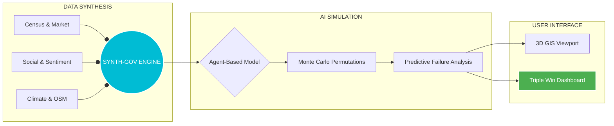

# 🏛️ Mysuru 3D Digital Twin
### Next-Gen Policy Impact Simulation Engine (P.I.S.E.)


<p align="center">
  
  
  
  
</p>

---

## 💎 THE CORE VISION
**Mysuru 3D Digital Twin** has evolved into a state-of-the-art **Agent-Based Digital Twin of Society**. We simulate the complex ripple effects of every policy decision on the 1.3 million citizens of Mysore in a synthetic environment.

> [!TIP]
> **Black Swan Detection**: Our heuristic engine identifies high-impact, low-probability failure points before they manifest in reality.

---

## 🛡️ THE P.I.S.E. FRAMEWORK
| Phase | Concept | Function |
| :--- | :--- | :--- |
| **01 🔴** | **The Problem** | Eliminating **Linear Policy Failure** (Static thinking & unintended ripple effects). |
| **02 🔵** | **The Solution** | Deploying a **Synthetic Environment** with 1 Million "What-If" scenarios. |
| **03 🟢** | **The Engine** | High-fidelity **Agent-Based Modeling (ABM)** for citizen-level simulation. |
| **04 🟡** | **The Impact** | Delivering a **Triple Win Dashboard** (Fiscal, Social, & Public Trust). |

---

## 🧠 THE CORE ANALYTICS ENGINE
By synthesizing multi-sector data streams, we generate real-time urban intelligence:

| 📥 INPUTS | ⚙️ ANALYSIS (SYNTH-GOV) | 📊 OUTPUTS |
| :--- | :--- | :--- |
| 🗃️ **Census Data** | Monte Carlo Permutations | 📡 **Risk Radar** |
| 📱 **Social Trends** | Predictive Failure Analysis | 📈 **Cross-Sectoral Impact** |
| 💹 **Market Flux** | Feedback Loop Heuristics | ⚠️ **Black Swan Detection** |
| ☁️ **Climate Logs** | Heuristic Urban Mapping | 🏁 **Optimal Policy Paths** |

---

## 🏆 TRIPLE WIN SCORECARD
| Metric | Focus Area | Real-World Impact |
| :--- | :--- | :--- |
| 💰 **Fiscal Responsibility** | Budget Optimization | Averted billions in wasted resources through simulation. |
| 👥 **Social Equity** | Ward-Level Growth | Perfectly balanced growth across all city demographics. |
| 🤝 **Public Trust** | Transparency | Increased citizen confidence via evidence-based governance. |

---

## 🎨 INTEGRATED COMMAND HUD

| Module | Core Features | Visual HUD Element |
| :--- | :--- | :--- |
| **🏗️ Admin Missions** | Simulated Demolitions, Street View Portals | **Structural X-Ray** |
| **🌊 Crisis Simulator** | 0-15m Flood Inundation Slider, EMS Routing | **Vascular Network** |
| **🌿 Eco-Trace** | AQI Heatmaps, Vegetation Health Index (VHI) | **Spectral Heatmap** |
| **⏳ Heritage Timeline** | 1920-2024 Urban Sprawl Temporal Voyager | **Chronos-View** |

---

## 💻 SYSTEM ARCHITECTURE



---

## 🚀 GETTING STARTED
> [!IMPORTANT]
> Ensure **Node.js v18+** is installed before running the simulation engine.

```bash
# 1. Initialize System
npm install && cd client && npm install

# 2. Launch Universal Interface
npm run dev
```

---

## 📂 PROJECT TAXONOMY
| Directory | Role | Content |
| :--- | :--- | :--- |
| `📂 client/` | **Interface** | Vite + React 3D HUD |
| `📂 data/` | **Intelligence** | Local GeoJSON sets (Mysuru) |
| `📂 server/` | **Engine** | Node.js Backend & Sims |
| `📂 scripts/` | **Automation** | Python Data Extraction |

---

<p align="center">
Developed by <b>Bharath Kumara</b><br/>
<i>Lead Architect & Digital Twin Engineer</i><br/>
<br/>

</p>
